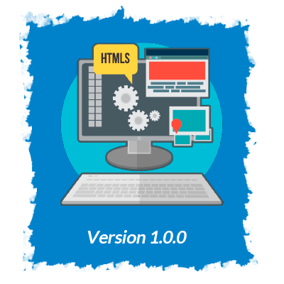

 

The version on top of this file this the last.

</img>

- Main page show the principal post and anothers 9 secondary.
- Responsive
- Search bar is working. 

</img>

- Select Nav is not working
- Live From TEDMontery doesnt show anything
- Doesnt show the info that can have a post inside
